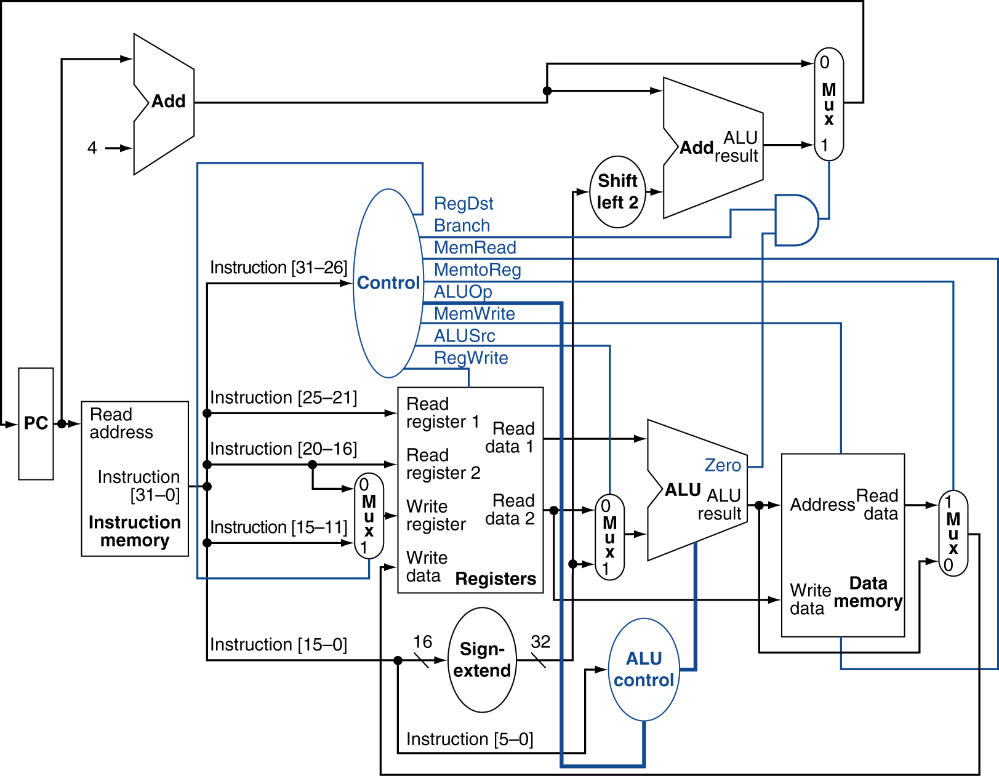

# 32-bit Single-Cycle MIPS Processor using Verilog HDL

This project demonstrates the design and implementation of a **32-bit Single-Cycle MIPS Processor** using **Verilog HDL** and verified through **Xilinx Vivado** simulation. The processor executes each instruction in a single clock cycle by integrating the datapath and control unit into a complete processor architecture.

The processor implements the fundamental components of a MIPS architecture, including the Program Counter, Instruction Memory, Register File, Arithmetic Logic Unit (ALU), Data Memory, Main Control Unit, ALU Control Unit, multiplexers, adders, and Next PC logic. Additional features such as overflow detection, invalid instruction detection, and support for jump instructions have also been implemented.

---
## Highlights

- Designed and implemented a **32-bit Single-Cycle MIPS Processor** in Verilog HDL.
- Supports **18 MIPS instructions** across **R-type, I-type, and J-type** formats.
- Includes **signed overflow detection** and **invalid instruction handling**.
- Verified functionality using a custom Verilog testbench and behavioral simulation in **Xilinx Vivado**.
- Modular architecture with reusable datapath and control components.

---

## Supported Instructions

| Instruction Format | Supported Instructions |
|--------------------|------------------------|
| **R-Type** | `add`, `sub`, `and`, `or`, `xor`, `nor`, `slt`, `jr` |
| **I-Type** | `addi`, `andi`, `ori`, `slti`, `lw`, `sw`, `beq`, `bne` |
| **J-Type** | `j`, `jal` |

---

## Processor Architecture

The processor consists of the following major modules:

- Program Counter (PC)
- Instruction Memory
- Main Control Unit
- Register File
- Immediate Extension Unit
- ALU Control Unit
- Arithmetic Logic Unit (ALU)
- Data Memory
- Multiplexers
- Adders
- Next PC Selection Logic
- Overflow Detection Logic
- Invalid Instruction Detection Logic
- Top-Level Processor Integration Module

Each module was designed independently and then integrated to implement the complete single-cycle processor.

---

## Project Structure

```text
single-cycle-mips-processor/
│
├── src/
│   ├── pc.v                  // Implements the Program Counter (PC)
│   ├── instruction_memory.v  // Stores the machine code instructions
│   ├── control_unit.v        // Generates the processor control signals
│   ├── register_file.v       // Implements the 32-bit register file
│   ├── sign_extend.v         // Performs sign and zero extension of immediates
│   ├── alu_control.v         // Generates ALU control signals
│   ├── alu.v                 // Performs arithmetic and logical operations
│   ├── data_memory.v         // Implements the data memory module
│   ├── mux4.v                // 4-to-1 multiplexers used in the datapath
│   ├── adder.v               // 32-bit adders used in the datapath
│   └── mips_top.v            // Top-level processor integrating all modules
│
├── sim/
│   ├── tb_mips.v             // Testbench for processor verification
│   └── instructions.mem      // Machine-code program for simulation
│
├── images/
│   ├── datapath.png          // Processor datapath diagram
│   ├── rtl.png               // RTL schematic generated in Vivado
│   └── waveform.png          // Simulation waveform
│
└── README.md                 // Project documentation
```

---

## Processor Datapath

The figure below illustrates the architecture of the implemented 32-bit Single-Cycle MIPS Processor.

<p align="center">
  <a href="images/singlecycledatapath.png">
    
  </a>
</p>

<p align="center">
  <sup><i>Figure adapted from the ES336 Computer Architecture lecture slides, IIT Gandhinagar.</i></sup>
</p>

---

## Datapath Execution Flow

Each instruction is executed in a single clock cycle through the following stages:

1. Fetch the instruction from Instruction Memory.
2. Decode the instruction and generate the required control signals.
3. Read operands from the Register File.
4. Perform arithmetic, logical, or comparison operations using the ALU.
5. Access Data Memory for load and store instructions.
6. Write the result back to the Register File when required.
7. Update the Program Counter based on sequential execution, branch, jump, or jump register logic at the next posedge of clock.

---

## Verification

The processor was verified using a custom Verilog testbench with machine-code programs stored in `instructions.mem`.

Verification includes:

- Arithmetic and logical operations
- Comparison instructions
- Memory access (`lw`, `sw`)
- Branch and jump instructions (`beq`, `bne`, `j`, `jal`, `jr`)
- Register file and data memory operations
- Program Counter update logic
- Signed overflow and invalid instruction detection

Behavioral simulation confirmed the correct execution of all supported instructions.

---

## Sample Program

The processor executes machine-code instructions stored in `instructions.mem`.

Example program:

```assembly
addi $t0, $zero, 10
addi $t1, $zero, 20

add  $t2, $t0, $t1
xor  $t3, $t0, $t1
slti $s0, $t0, 15

sw   $t2, 0($zero)
lw   $s1, 0($zero)

bne  $s1, $t0, TARGET
jal  FUNCTION
......
......
TARGET:
j EXIT
......
FUNCTION:
jr $ra
......
EXIT:
```

---

## Simulation Results

Behavioral simulation was performed using Xilinx Vivado to verify the functionality of the 32-bit single-cycle MIPS processor.

| Instruction Category | Instructions Verified | Waveform |
|----------------------|----------------------|----------|
| Arithmetic Operations | `addi`, `add`, `sub` | [View Waveform](images/Waveform1.png) |
| Logical & Comparison Operations | `and`, `or`, `xor`, `nor`, `slt`, `andi`, `ori`, `slti` | [View Waveform](images/Waveform2.png) |
| Memory Access | `lw`, `sw` | [View Waveform](images/Waveform3.png) |
| Branch Instructions | `beq`, `bne` | [View Waveform](images/Waveform4.png) |
| Jump Instructions | `j`, `jal`, `jr` | [View Waveform](images/Waveforms5.png) |
| Exception Handling | Overflow and Invalid Instruction Detection | [View Waveform](images/Waveform6.png) |

---

## Tools Used

- Verilog HDL
- Xilinx Vivado

---

## Future Improvements

Possible extensions to this processor include:

- Five-stage pipelined MIPS architecture
- Implementation of much more instructions 
- FPGA implementation and hardware validation

## References

1. John L. Hennessy and David A. Patterson, *Computer Architecture: A Quantitative Approach*, Morgan Kaufmann Publishers.

2. David A. Patterson and John L. Hennessy, *Computer Organization and Design: The Hardware/Software Interface*, Morgan Kaufmann Publishers.

3. ES336 – Computer Architecture and Organization, Lecture Slides, Indian Institute of Technology Gandhinagar.

---
## Author

**Bhavya Jain**

B.Tech, Integrated Circuit Design and Technology (ICDT)  
Indian Institute of Technology Gandhinagar
